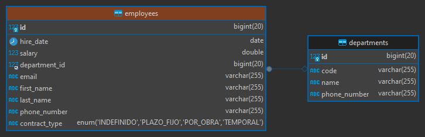

# Spring Data JPA - Avanzado

- Tutorial que implementa **Criteria API:**
  [spring-data-jpa-criteria-queries](https://github.com/magadiflo/spring-data-jpa-criteria-queries.git)
- Tutorial que habla netamente de **Specifications:**
  [spring-data-jpa-specifications]( https://github.com/magadiflo/spring-data-jpa-specifications.git)
- Tutorial que habla netamente de **Projections:**
  [spring-data-jpa-projections]( https://github.com/magadiflo/spring-data-jpa-projections.git)
- Tutorial donde se usa **Specifications** y **Projections**:
  [spring-boot-web-crud](https://github.com/magadiflo/spring-boot-web-crud.git)

## Dependencias

````xml
<!--Spring Boot 3.2.3-->
<!--Java 21-->
<dependencies>
    <dependency>
        <groupId>org.springframework.boot</groupId>
        <artifactId>spring-boot-starter-data-jpa</artifactId>
    </dependency>
    <dependency>
        <groupId>org.springframework.boot</groupId>
        <artifactId>spring-boot-starter-web</artifactId>
    </dependency>

    <dependency>
        <groupId>org.hibernate.orm</groupId>
        <artifactId>hibernate-jpamodelgen</artifactId>
    </dependency>
    <dependency>
        <groupId>com.mysql</groupId>
        <artifactId>mysql-connector-j</artifactId>
        <scope>runtime</scope>
    </dependency>
    <dependency>
        <groupId>org.projectlombok</groupId>
        <artifactId>lombok</artifactId>
        <optional>true</optional>
    </dependency>
    <dependency>
        <groupId>org.springframework.boot</groupId>
        <artifactId>spring-boot-starter-test</artifactId>
        <scope>test</scope>
    </dependency>
</dependencies>
````

## Propiedades

````yml
server:
  port: 8080
  error:
    include-message: always

spring:
  application:
    name: spring-data-jpa-advanced

  datasource:
    url: jdbc:mysql://localhost:3306/db_spring_data_jpa
    username: admin
    password: magadiflo

  jpa:
    hibernate:
      ddl-auto: create-drop
    properties:
      hibernate:
        format_sql: true

logging:
  level:
    org.hibernate.SQL: DEBUG
````

## Entidades

````java

@NoArgsConstructor
@AllArgsConstructor
@Builder
@Data
@Entity
@Table(name = "employees")
public class Employee {
    @Id
    @GeneratedValue(strategy = GenerationType.IDENTITY)
    private Long id;
    private String firstName;
    private String lastName;
    private String email;
    private String phoneNumber;
    private LocalDate hireDate;
    private Double salary;
    @Enumerated(EnumType.STRING)
    private ContractType contractType;

    @ManyToOne
    @JoinColumn(name = "department_id")
    private Department department;
}
````

````java

@NoArgsConstructor
@AllArgsConstructor
@Builder
@Data
@Entity
@Table(name = "departments")
public class Department {
    @Id
    @GeneratedValue(strategy = GenerationType.IDENTITY)
    private Long id;
    private String code;
    private String name;
    private String phoneNumber;
}
````

### Tablas generadas



## Modelos

````java
public enum ContractType {
    INDEFINIDO, PLAZO_FIJO, POR_OBRA, TEMPORAL
}
````

## Repositorios

````java
public interface EmployeeRepository extends JpaRepository<Employee, Long> {
}
````

````java
public interface DepartmentRepository extends JpaRepository<Department, Long> {
}
````

## Listando empleados con interfaz de proyección cerrada

La interfaz de proyección cerrada contendrá únicamente la representación de 4 columnas:

````java
public interface BasicEmployeeInformationProjection {
    String getFirstName();

    String getLastName();

    String getEmail();

    String getPhoneNumber();
}
````

Creamos la consulta personalizada usando la anotación `@Query`. Es importante definir a cada columna de la consulta
un alias. El `alias` de cada columna debe tener el mismo nombre que le definimos a su correspondiente propiedad de
la entidad que representa. Por ejemplo, como estamos consultando a la tabla `employees`, significa que debemos tener
una entidad llamada `Employee`, ahora, si nos fijamos en la propiedad de la tabla `employees` de la base de datos,
vemos el campo `first_name`, que corresponde a la propiedad `firstName` de la entidad java, por consiguiente, el
alias que le definamos a la columna `first_name` deberá ser `firstName`.

````java
public interface EmployeeRepository extends JpaRepository<Employee, Long> {
    @Query(value = """
            SELECT e.first_name AS firstName,
                    e.last_name AS lastName,
                    e.email AS email,
                    e.phone_number AS phoneNumber
            FROM employees AS e
            """, nativeQuery = true)
    List<BasicEmployeeInformationProjection> findEmployeesBasicInformation();
}
````

Creamos nuestra capa de servicio para la entidad `Employee`, desde donde haremos uso del repositorio
`EmployeeRepository`:

````java
public interface EmployeeService {
    List<BasicEmployeeInformationProjection> findEmployeesBasicInformation();
}
````

````java

@RequiredArgsConstructor
@Slf4j
@Service
public class EmployeeServiceImpl implements EmployeeService {

    private final EmployeeRepository employeeRepository;

    @Override
    @Transactional(readOnly = true)
    public List<BasicEmployeeInformationProjection> findEmployeesBasicInformation() {
        return this.employeeRepository.findEmployeesBasicInformation();
    }
}
````

Finalmente, en la capa web definimos nuestro controlador:

````java

@RequiredArgsConstructor
@Slf4j
@RestController
@RequestMapping(path = "/api/v1/employees")
public class EmployeeRestController {

    private final EmployeeService employeeService;

    @GetMapping(path = "/basic-information-list")
    public ResponseEntity<List<BasicEmployeeInformationProjection>> findEmployeesBasicInformation() {
        return ResponseEntity.ok(this.employeeService.findEmployeesBasicInformation());
    }
}
````

### Resultados obtenidos

Observamos que obtenemos la lista completa de la consulta realizada:

````bash
$ curl -v http://localhost:8080/api/v1/employees/basic-information-list | jq

>
< HTTP/1.1 200
[
  {
    "email": "almagro@gmail.com",
    "phoneNumber": "963258969",
    "lastName": "Almagro",
    "firstName": "Martín"
  },
  {
    "email": "lucia@gmail.com",
    "phoneNumber": "985478969",
    "lastName": "Campos",
    "firstName": "Lucía"
  },
  {...},
  {...},
  {...},
  {...},
  {
    "email": "ciro@gmail.com",
    "phoneNumber": "943851697",
    "lastName": "Alegría",
    "firstName": "Judith"
  }
]
````

En log de la consola, observamos nuestra consulta `SQL` que se ha ejecutado:

````bash
2024-03-07T11:15:02.496-05:00 DEBUG 4188 --- [spring-data-jpa-advanced] [nio-8080-exec-2] org.hibernate.SQL                        : 
    SELECT
        e.first_name AS firstName,
        e.last_name AS lastName,
        e.email AS email,
        e.phone_number AS phoneNumber 
    FROM
        employees AS e 
````
