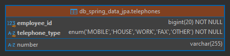
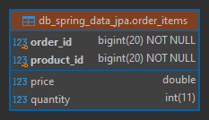

# Spring Data JPA - Avanzado

- Tutorial que implementa **Criteria API:**
  [spring-data-jpa-criteria-queries](https://github.com/magadiflo/spring-data-jpa-criteria-queries.git)
- Tutorial que habla netamente de **Specifications:**
  [spring-data-jpa-specifications]( https://github.com/magadiflo/spring-data-jpa-specifications.git)
- Tutorial que habla netamente de **Projections:**
  [spring-data-jpa-projections]( https://github.com/magadiflo/spring-data-jpa-projections.git)
- Tutorial donde se usa **Specifications** y **Projections**:
  [spring-boot-web-crud](https://github.com/magadiflo/spring-boot-web-crud.git)

## Dependencias

````xml
<!--Spring Boot 3.2.3-->
<!--Java 21-->
<dependencies>
    <dependency>
        <groupId>org.springframework.boot</groupId>
        <artifactId>spring-boot-starter-data-jpa</artifactId>
    </dependency>
    <dependency>
        <groupId>org.springframework.boot</groupId>
        <artifactId>spring-boot-starter-web</artifactId>
    </dependency>

    <dependency>
        <groupId>org.hibernate.orm</groupId>
        <artifactId>hibernate-jpamodelgen</artifactId>
    </dependency>
    <dependency>
        <groupId>com.mysql</groupId>
        <artifactId>mysql-connector-j</artifactId>
        <scope>runtime</scope>
    </dependency>
    <dependency>
        <groupId>org.projectlombok</groupId>
        <artifactId>lombok</artifactId>
        <optional>true</optional>
    </dependency>
    <dependency>
        <groupId>org.springframework.boot</groupId>
        <artifactId>spring-boot-starter-test</artifactId>
        <scope>test</scope>
    </dependency>
</dependencies>
````

## Propiedades

````yml
server:
  port: 8080
  error:
    include-message: always

spring:
  application:
    name: spring-data-jpa-advanced

  datasource:
    url: jdbc:mysql://localhost:3306/db_spring_data_jpa
    username: admin
    password: magadiflo

  jpa:
    hibernate:
      ddl-auto: create-drop
    properties:
      hibernate:
        format_sql: true

logging:
  level:
    # Para mostrar el SQL generado
    org.hibernate.SQL: DEBUG
    # Para mostrar el valor de los parámetros que pasamos a una consulta
    org.hibernate.orm.jdbc.bind: TRACE
````

## Entidades

````java

@NoArgsConstructor
@AllArgsConstructor
@Builder
@Data
@Entity
@Table(name = "employees")
public class Employee {
    @Id
    @GeneratedValue(strategy = GenerationType.IDENTITY)
    private Long id;
    private String firstName;
    private String lastName;
    private String email;
    private String phoneNumber;
    private LocalDate hireDate;
    private Double salary;
    @Enumerated(EnumType.STRING)
    private ContractType contractType;

    @ManyToOne
    @JoinColumn(name = "department_id")
    private Department department;
}
````

````java

@NoArgsConstructor
@AllArgsConstructor
@Builder
@Data
@Entity
@Table(name = "departments")
public class Department {
    @Id
    @GeneratedValue(strategy = GenerationType.IDENTITY)
    private Long id;
    private String code;
    private String name;
    private String phoneNumber;
}
````

### Tablas generadas


## Modelos

````java
public enum ContractType {
    INDEFINIDO, PLAZO_FIJO, POR_OBRA, TEMPORAL
}
````

## Repositorios

````java
public interface EmployeeRepository extends JpaRepository<Employee, Long> {
}
````

````java
public interface DepartmentRepository extends JpaRepository<Department, Long> {
}
````

## Listando empleados con interfaz de proyección cerrada

La interfaz de proyección cerrada contendrá únicamente la representación de 4 columnas:

````java
public interface BasicEmployeeInformationProjection {
    String getFirstName();

    String getLastName();

    String getEmail();

    String getPhoneNumber();
}
````

Creamos la consulta personalizada usando la anotación `@Query`. Es importante definir a cada columna de la consulta
un alias. El `alias` de cada columna debe tener el mismo nombre que le definimos a su correspondiente propiedad de
la entidad que representa. Por ejemplo, como estamos consultando a la tabla `employees`, significa que debemos tener
una entidad llamada `Employee`, ahora, si nos fijamos en la propiedad de la tabla `employees` de la base de datos,
vemos el campo `first_name`, que corresponde a la propiedad `firstName` de la entidad java, por consiguiente, el
alias que le definamos a la columna `first_name` deberá ser `firstName`.

````java
public interface EmployeeRepository extends JpaRepository<Employee, Long> {
    @Query(value = """
            SELECT e.first_name AS firstName,
                    e.last_name AS lastName,
                    e.email AS email,
                    e.phone_number AS phoneNumber
            FROM employees AS e
            """, nativeQuery = true)
    List<BasicEmployeeInformationProjection> findEmployeesBasicInformation();
}
````

Creamos nuestra capa de servicio para la entidad `Employee`, desde donde haremos uso del repositorio
`EmployeeRepository`:

````java
public interface EmployeeService {
    List<BasicEmployeeInformationProjection> findEmployeesBasicInformation();
}
````

````java

@RequiredArgsConstructor
@Slf4j
@Service
public class EmployeeServiceImpl implements EmployeeService {

    private final EmployeeRepository employeeRepository;

    @Override
    @Transactional(readOnly = true)
    public List<BasicEmployeeInformationProjection> findEmployeesBasicInformation() {
        return this.employeeRepository.findEmployeesBasicInformation();
    }
}
````

Finalmente, en la capa web definimos nuestro controlador:

````java

@RequiredArgsConstructor
@Slf4j
@RestController
@RequestMapping(path = "/api/v1/employees")
public class EmployeeRestController {

    private final EmployeeService employeeService;

    @GetMapping(path = "/basic-information-list")
    public ResponseEntity<List<BasicEmployeeInformationProjection>> findEmployeesBasicInformation() {
        return ResponseEntity.ok(this.employeeService.findEmployeesBasicInformation());
    }
}
````

### Resultados obtenidos

Observamos que obtenemos la lista completa de la consulta realizada:

````bash
$ curl -v http://localhost:8080/api/v1/employees/basic-information-list | jq

>
< HTTP/1.1 200
[
  {
    "email": "almagro@gmail.com",
    "phoneNumber": "963258969",
    "lastName": "Almagro",
    "firstName": "Martín"
  },
  {
    "email": "lucia@gmail.com",
    "phoneNumber": "985478969",
    "lastName": "Campos",
    "firstName": "Lucía"
  },
  {...},
  {...},
  {...},
  {...},
  {
    "email": "ciro@gmail.com",
    "phoneNumber": "943851697",
    "lastName": "Alegría",
    "firstName": "Judith"
  }
]
````

En log de la consola, observamos nuestra consulta `SQL` que se ha ejecutado:

````bash
2024-03-07T11:15:02.496-05:00 DEBUG 4188 --- [spring-data-jpa-advanced] [nio-8080-exec-2] org.hibernate.SQL                        : 
    SELECT
        e.first_name AS firstName,
        e.last_name AS lastName,
        e.email AS email,
        e.phone_number AS phoneNumber 
    FROM
        employees AS e 
````

## Listando empleados con proyección y paginación

Dentro de la interfaz `EmployeeRepository` crearemos un método personalizado usando la anotación `Query`, donde nos
devolverá un `Page` de nuestra proyección `BasicEmployeeInformationProjection`. Este método recibirá un `Pageable`
donde se definirán algunos parámetros de paginación como el `pageNumber`, `pageSize`:

````java
public interface EmployeeRepository extends JpaRepository<Employee, Long> {
    /* other method */

    @Query(value = """
            SELECT e.first_name AS firstName,
                    e.last_name AS lastName,
                    e.email AS email,
                    e.phone_number AS phoneNumber
            FROM employees AS e
            """,
            countQuery = """
                    SELECT COUNT(*)
                    FROM employees
                    """,
            nativeQuery = true)
    Page<BasicEmployeeInformationProjection> findEmployeesBasicInformationPage(Pageable pageable);
}
````

Nuestra interfaz anterior sigue extendiendo de `JpaRepository`, pero para este caso en particular, necesitamos crear
nuestro método personalizado de consulta que recibirá un `Pageable` y retornará un `Page`.

Si observamos la anotación `Query` en el atributo `value` definimos nuestra consulta con las columnas que queremos
recuperar y que están acorde a los métodos definidos en nuestra proyección `BasicEmployeeInformationProjection`.
Además, observamos una consulta adicional en el atributo `countQuery`.

El `countQuery`, define una consulta de recuento especial que se utilizará para `consultas de paginación` para buscar
el número total de elementos de una página. **Si no hay ninguno configurado, derivaremos la consulta de recuento de la
consulta original o de la consulta countProjection(), si corresponde.** En nuestro caso, si no hubiéramos definido la
consulta en el atributo `countQuery`, automáticamente jpa habría generado la siguiente consulta para dicho atributo:

````sql
select
    count(1) 
FROM
    employees AS e
````

En nuestro caso, sí estamos definiendo explícitamente la consulta en el atributo `countQuery`:

````sql
SELECT COUNT(*)
FROM employees
````

En el `EmployeeService` definimos un nuevo método, el cual lo implementaremos en el `EmployeeServiceImpl`:

````java
public interface EmployeeService {
    /* other method */
    Page<BasicEmployeeInformationProjection> findEmployeesBasicInformationPagination(Pageable pageable);
}
````

````java

@RequiredArgsConstructor
@Slf4j
@Service
public class EmployeeServiceImpl implements EmployeeService {

    private final EmployeeRepository employeeRepository;

    /* other method */

    @Override
    public Page<BasicEmployeeInformationProjection> findEmployeesBasicInformationPagination(Pageable pageable) {
        return this.employeeRepository.findEmployeesBasicInformationPage(pageable);
    }
}
````

Finalmente, creamos un endpoint en nuestro controlador para llamar al método del servicio anterior:

````java

@RequiredArgsConstructor
@Slf4j
@RestController
@RequestMapping(path = "/api/v1/employees")
public class EmployeeRestController {

    private final EmployeeService employeeService;

    /* method */

    @GetMapping(path = "/basic-information-pagination")
    public ResponseEntity<Page<BasicEmployeeInformationProjection>> findEmployeesBasicInformationPagination(
            @RequestParam(name = "pageNumber", defaultValue = "0", required = false) int pageNumber,
            @RequestParam(name = "pageSize", defaultValue = "5", required = false) int pageSize) {
        Pageable pageable = PageRequest.of(pageNumber, pageSize);
        return ResponseEntity.ok(this.employeeService.findEmployeesBasicInformationPagination(pageable));
    }
}
````

### Resultados obtenidos

````bash
$ curl -v http://localhost:8080/api/v1/employees/basic-information-pagination | jq

>
< HTTP/1.1 200
<
{
  "content": [
    {
      "phoneNumber": "963258969",
      "email": "almagro@gmail.com",
      "firstName": "Martín",
      "lastName": "Almagro"
    },
    {...},
    {...},
    {...},
    {
      "phoneNumber": "953689596",
      "email": "mgonzales@gmail.com",
      "firstName": "Liz",
      "lastName": "Gonzales"
    }
  ],
  "pageable": {
    "pageNumber": 0,
    "pageSize": 5,
    "sort": {
      "sorted": false,
      "empty": true,
      "unsorted": true
    },
    "offset": 0,
    "unpaged": false,
    "paged": true
  },
  "last": false,
  "totalPages": 3,
  "totalElements": 11,
  "size": 5,
  "number": 0,
  "sort": {
    "sorted": false,
    "empty": true,
    "unsorted": true
  },
  "numberOfElements": 5,
  "first": true,
  "empty": false
}
````

````bash
2024-03-07T12:59:24.665-05:00 DEBUG 10488 --- [spring-data-jpa-advanced] [nio-8080-exec-1] org.hibernate.SQL                        : 
    SELECT
        e.first_name AS firstName,
        e.last_name AS lastName,
        e.email AS email,
        e.phone_number AS phoneNumber 
    FROM
        employees AS e 
    limit
        ? 
2024-03-07T12:59:24.727-05:00 DEBUG 10488 --- [spring-data-jpa-advanced] [nio-8080-exec-1] org.hibernate.SQL                        : 
    SELECT
        COUNT(*) 
    FROM
        employees
````

---

# Claves primarias compuestas

---

En la medida en que utilizamos bases de datos relacionales, tenemos que considerar los campos clave que actúan como
identificadores de la tabla. Además de las claves primarias habituales, la clave compuesta desempeña un papel
específico, ya que varios candidatos generan colectivamente el identificador.

En `JPA (Java Persistence API)`, hay dos formas de especificar claves compuestas de entidad: `@IdClass` y `@EmbeddedId`.

## [Claves primarias compuestas con @IdClass](https://www.oscarblancarteblog.com/2016/11/02/llaves-compuestas-idclass/)

En este apartado explicaremos cómo manejamos la relación de clave compuesta en la aplicación Java Spring Boot
utilizando la anotación `@Idclass`.

La utilización de `@IdClass` es una de las dos opciones para definir `claves primarias compuestas`, y esta consiste en
crear una clase adicional únicamente con los campos que corresponden a la clave primaria.

Veamos un caso concreto, normalmente un empleado puede tener más de un teléfono, entonces, podríamos crear una tabla
donde la `clave primaria` sea el `ID del empleado` y el `tipo de teléfono`, de esta forma nos aseguramos de tener solo
un tipo de teléfono por empleado.

Empecemos creando una clase de enumeración para tener bien definido los tipos de teléfonos que manejará nuestra entidad.

````java
public enum TelephoneType {
    MOBILE, HOUSE, WORK, FAX, OTHER
}
````

Veamos cómo quedaría la clase `PK` con los atributos que formarán parte de nuestra `clave primaria compuesta`. Algo
que podría resaltar aquí es que el atributo `telephoneType` podríamos haberlo definido como un `String`, pero para
acotar los tipos de teléfono a manejar y no escribir cualquier cadena, es que lo he definido del tipo `enum`.

````java

@EqualsAndHashCode
@Setter
@Getter
public class TelephonePK {
    private Long employeeId;
    private TelephoneType telephoneType;
}
````

Definimos la clase `TelephonePK`, quien tiene como atributos el `employeeId` y el `telephoneType`.
Observemos que esta clase no requiere de ningún tipo de anotación especial, pero `sí es requerido` sobrescribir los
métodos `hashCode & equals`, en nuestro caso eso lo hacemos con la anotación de lombok `@EqualsAndHashCode`. Además,
aprovechamos el poder de lombok para generar los `@Getter` y `@Setter`. Es decir, si no hubiéramos usado esas
anotaciones de lombok, simplemente habríamos escrito mano el código que representan. Más allá de eso, esta clase
no requiere ninguna anotación especial.

La siguiente clase que definimos es la entidad `Telephone`, quien representa un teléfono de empleado.

````java

@ToString
@AllArgsConstructor
@NoArgsConstructor
@Builder
@Setter
@Getter
@IdClass(TelephonePK.class)
@Entity
@Table(name = "telephones")
public class Telephone {
    @Id
    private Long employeeId;
    @Id
    @Enumerated(EnumType.STRING)
    private TelephoneType telephoneType;

    private String number;
}
````

Observemos que esta clase cuenta con los atributos `employeeId` y `telephoneType` anotados con `@Id`. Además, tiene la
anotación `@IdClass` a nivel de clase y como valor tiene la clase `TelephonePK.class`.

Un dato importante es que tanto la definición de los atributos en la clase ID (`TelephonePK`) como en la clase
de entidad (`Telephone`) deben de coincidir a la perfección en caso contrario provocara un error en tiempo de ejecución.

Según la documentación dice:

> `@IdClass`, especifica una `clase de clave principal compuesta` que se asigna a varios campos o propiedades de la
> entidad. Los nombres de los campos o propiedades de la clase de clave principal y los campos o propiedades de clave
> principal de la entidad deben corresponderse y sus tipos deben ser los mismos.

Tras aplicar estos últimos cambios, ejecutamos la aplicación y vemos en el log, la creación de la tabla `telephones`
y como `clave primaria compuesta` la combinación de `(employee_id, telephone_type)`.

````bash
2024-10-27T00:17:18.848-05:00 DEBUG 17732 --- [spring-data-jpa-advanced] [           main] org.hibernate.SQL                        : 
    create table telephones (
        employee_id bigint not null,
        number varchar(255),
        telephone_type enum ('MOBILE','HOUSE','WORK','FAX','OTHER') not null,
        primary key (employee_id, telephone_type)
    ) engine=InnoDB
````

Observamos en la tabla que nuestra clave primaria compuesta se ha creado correctamente.



## [Claves primarias compuestas con @EmbeddedId](https://www.oscarblancarteblog.com/2016/11/08/embeber-llave-primaria-embeddedid/)

Otra manera de definir `claves primarías compuestas` es con la anotación `@EmbeddedId`, quien anota a una clase
como `ID`. A diferencia de `@IdClass`, este método no requiere definir los atributos de la clave primaria en la entidad,
sino que solo hace falta agregar como atributo la clase que contiene todos los campos.

Una diferencia que tiene este método con respecto al `@IdClass`, es qué es necesario que la clase `ID` esté
anotada a nivel de clase con la anotación `@Embeddable`. Esto le dice a `JPA` que esta clase se puede embeber
dentro de otra.

Creamos la clase `OrderItemPK` que contendrá las claves primarias compuestas `orderId` y `productId`.

````java

@AllArgsConstructor
@NoArgsConstructor
@EqualsAndHashCode
@Setter
@Getter
@Embeddable
public class OrderItemPK {
    private Long orderId;
    private Long productId;
}
````

Observemos primero que nada que se le agregó la anotación `@Embeddable` a nivel de clase y los métodos equals y hashCode
con la anotación de lombok `@EqualsAndHashCode`.

Ahora creamos la entidad `OrderItem` que incluirá la clase `OrderItemPK` como identificador.

````java

@ToString
@AllArgsConstructor
@NoArgsConstructor
@Builder
@Setter
@Getter
@Entity
@Table(name = "order_items")
public class OrderItem {

    @EmbeddedId
    private OrderItemPK id;

    private Integer quantity;
    private Double price;
}
````

Observemos que como identificador usamos la clase `OrderItemPK` a quien lo anotamos con `@EmbeddedId`.

La anotación `@EmbeddedId` provocará que los campos definidos en la clase `OrderItemPK` sean considerados como
si fueran parte de la clase `OrderItem`.

Cabe mencionar que tanto `@IdClass` como `@EmbeddedId` darán el mismo resultado en tiempo de ejecución, por lo que
la única diferencia es solo a nivel del código. Recordemos que con `@IdClass` es necesario definir los campos que serán
la clave primaria tanto en la entidad como en las clases Id, en cambio, con `@EmbeddedId` solo será necesario embeber
la clave como una propiedad más de la clase. Particularmente yo prefiero trabajar con `@EmbeddedId` para evitar
repetir atributos.

Ahora, si ejecutamos la aplicación veremos el siguiente resultado en consola.

````bash
2024-10-27T01:11:28.953-05:00 DEBUG 11236 --- [spring-data-jpa-advanced] [           main] org.hibernate.SQL                        : 
    create table order_items (
        price float(53),
        quantity integer,
        order_id bigint not null,
        product_id bigint not null,
        primary key (order_id, product_id)
    ) engine=InnoDB
````

Observamos que se nos ha creado correctamente la clave primaria compuesta `(order_id, product_id)`. Ahora, si revisamos
la tabla en la base de datos obtendremos gráficamente el mismo resultado.

